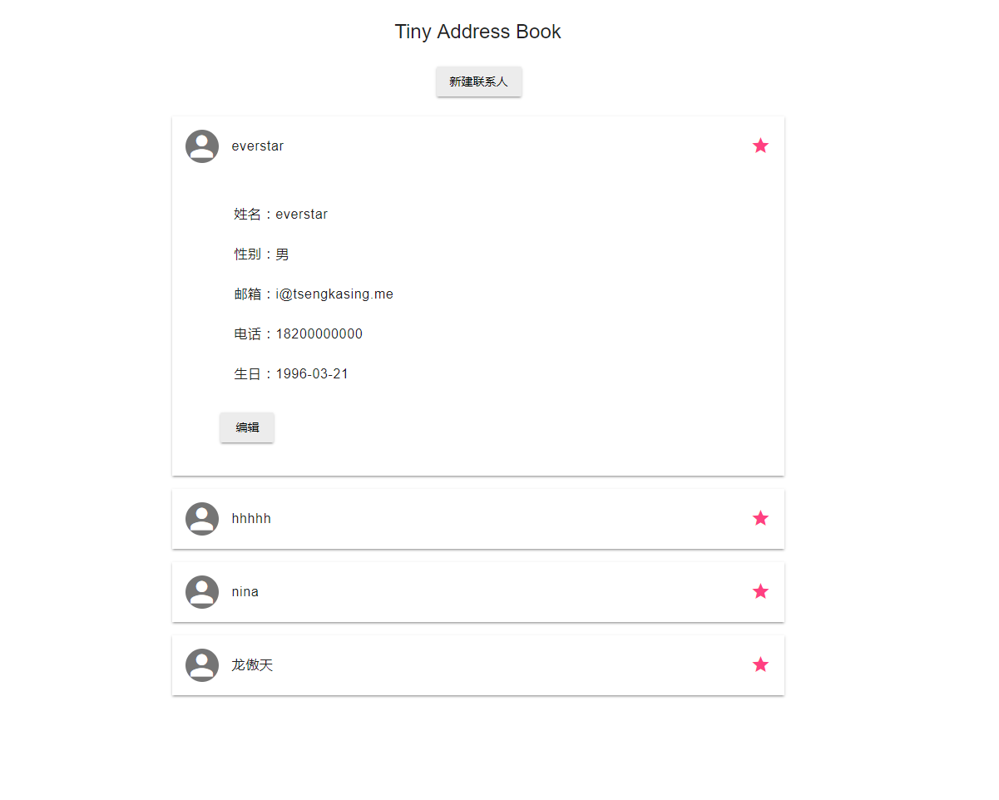
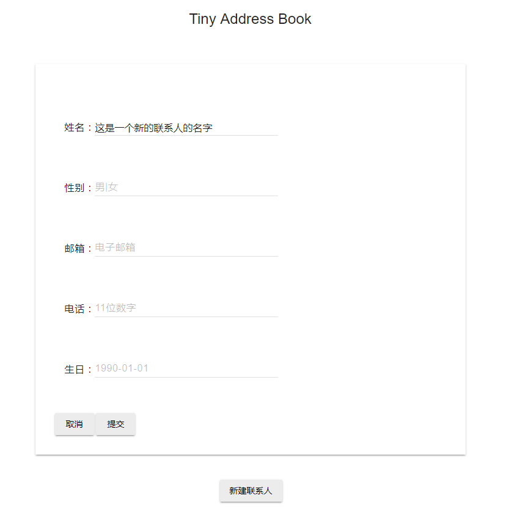
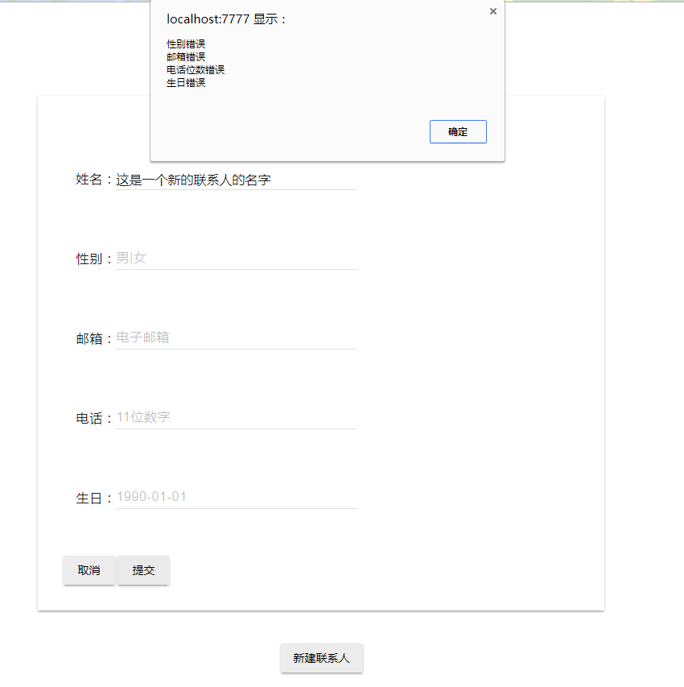
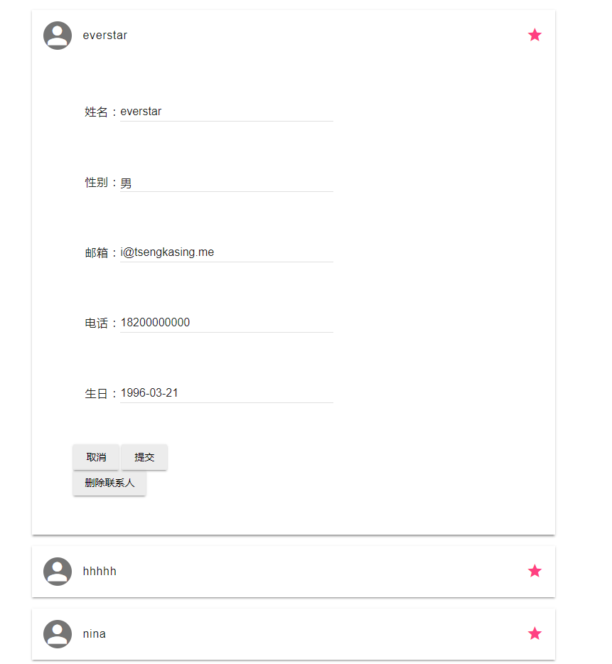

# hw
2017 Summer Camp HW3 Backend

## 主界面



## 数据结构

```
//通讯录记录对象
class AddressItem {
    var $name;
    var $gender;
    var $email_address;
    var $phone;
    var $birthday;
    var $star;

    function AddressItem($name, $gender, $email_address, $phone, $birthday) {
        $this->name = $name;
        $this->gender = $gender;
        $this->email_address = $email_address;
        $this->phone = $phone;
        $this->birthday = $birthday;
        $this->star = false;
    }

    function getName() {
        return $this->name;
    }

    function getGender() {
        return $this->gender;
    }

    function getEmailAddress() {
        return $this->email_address;
    }

    function getPhone() {
        return $this->phone;
    }

    function getBirthday() {
        return $this->birthday;
    }

    function setInfo($name, $gender, $email_address, $phone, $birthday) {
        $this->name = $name;
        $this->gender = $gender;
        $this->email_address = $email_address;
        $this->phone = $phone;
        $this->birthday = $birthday;
    }

    //本意想添加一个加星标的功能最后因为时间原因弃疗
    function star($star) {
        $this->star = $star;
    }
}
```

## 持久化方法

使用文本文件存储
序列化与反序列化

## 新建联系人

1.发送新建联系人的名字、性别、邮箱、电话、生日到add.php
2.读取文件
3.反序列化
4.将新的对象放到数组末尾
5.序列化
6.写入文件



## 合法性校验

提交之前，调用js函数使用正则表达式检测合法性

```
let name = document.getElementById('name-add').value;
let gender = document.getElementById('gender-add').value;
let email = document.getElementById('email-add').value;
let phone = document.getElementById('phone-add').value;
let birthday = document.getElementById('birthday-add').value;

if(gender !== '男' && gender !== '女') {
    pass = false;
    error_text += '性别错误\n';
}
if(!/^([a-zA-Z0-9_-])+@([a-zA-Z0-9_-])+(.[a-zA-Z0-9_-])+/.test(email)) {
    pass = false;
    error_text += '邮箱错误\n';
}
if(phone.length !== 11) {
    pass = false;
    error_text += '电话位数错误\n';
}
if(Array.prototype.filter.call(phone, function(digit) {
        return !isNaN(digit);
    }).length !== phone.length) {
    pass = false;
    error_text += '电话输入非数字\n';
}
if(!/^(\d{4})-(\d{1,2})-(\d{1,2})$/.test(birthday)) {
    pass = false;
    error_text += '生日错误\n';
}

```



## 编辑修改联系人

1.发送数组索引index、修改后的名字、性别、邮箱、电话、生日到edit.php
2.读取文件
3.反序列化
4.修改数组
5.序列化
6.写入文件



## 删除联系人

1.发送数组索引index到delete.php
2.读取文件
3.反序列化
4.删除数组指定索引的元素
5.序列化
6.写入文件